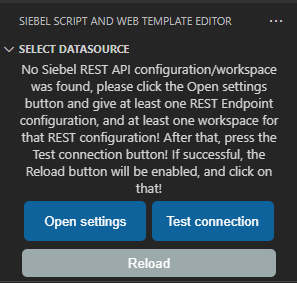
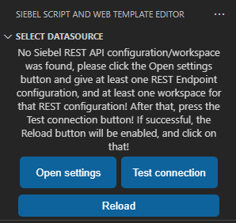
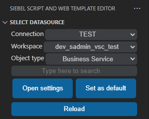
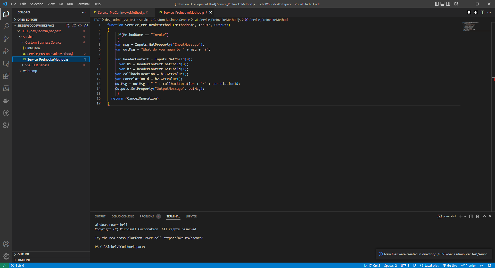
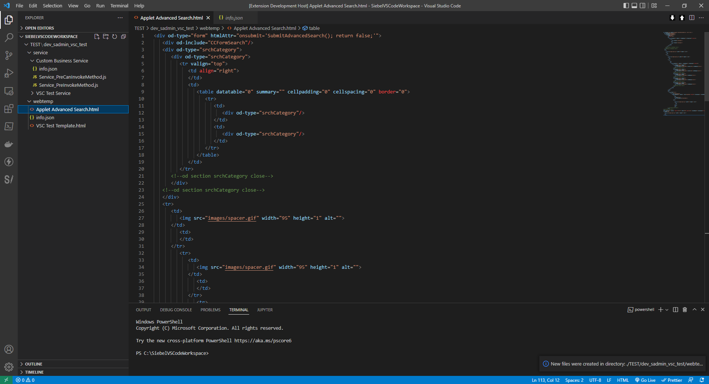
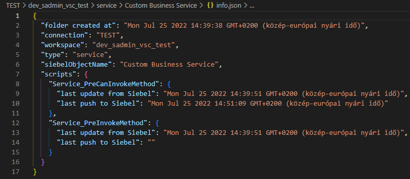
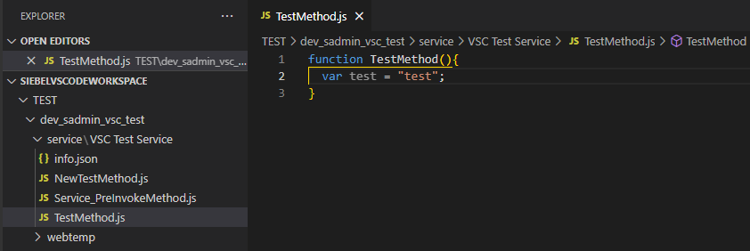

Siebel Script And Web Template Editor is a Visual Studio Code extension, which enables editing Siebel object server scripts and web templates directly in VS Code, using the Siebel REST API.

# 1. Installation

The Siebel Script And Web Template Editor can be installed from the Visual Studio Code Extensions Marketplace.

Alternatively, it can be installed with the siebelscriptandwebtempeditor-\<VERSION_NUMBER\>.vsix extension file, which can be found in the repository. To install the extension from the .vsix file, run the following command:
```
code --install-extension <DOWNLOAD_PATH>\siebelscriptandwebtempeditor-<VERSION_NUMBER>.vsix
```

The command shall respond with:

```
Extension 'siebelscriptandwebtempeditor-<VERSION_NUMBER>.vsix' was successfully installed.
```

> Some other/warning messages may be displayed, but that's OK as long as the installation is successful.

Start VS Code (or if it was already running, restart it). A new icon will appear in the left sidebar to access the extension's UI:


# 2. Usage

**IMPORTANT**: Make sure to open a folder before using the extension. It downloads scripts and other datafiles needed for its operation into this folder. You can name this folder any way you want (in the example below it's named `siebelvscodeworkspace`):


## 2.1. Configuration

After clicking on the extension's icon and you do not have any connections configured yet, the settings for the extension will open:


Currently there are four settings for the extension:
- __REST Endpoint Configurations__: used for communicating with the Siebel REST API. See [Configuring Siebel REST API connections](#211-configuring-siebel-rest-api-connections).
- __Workspaces__: the different workspaces used for the different connections. See [Configuring workspaces for connections](#212-configuring-workspaces-for-connections).
- __Default Connection__: the default connection and workspace to use on startup. Normally it should be set using the __Set as default__ button on the extension's UI.
- __Get Workspaces From REST__: if this checkbox is set to true, the workspaces for the connections will be fetched from the Siebel REST API, without manually writing the Workspaces setting. In order for this feature to work, an integration object has to be imported into Siebel. See [Getting workspace data from REST](#213-getting-workspace-data-from-rest) for more details.

### 2.1.1. Configuring Siebel REST API connections

To use the extension, at least one REST Endpoint Connection must be configured in the **REST Endpoint Configurations** setting, and a workspace for that as well. The connection is represented by a string of the following format:

```
ConnectionName/SiebelUsername/SiebelPassword@SiebelRestEndpoint
```

Where:
- `ConnectionName` is a unique name to identify the connection. It is the name displayed in the extension's UI when selecting the connection, and this name is used to identify the workspaces which belong to this connection. Use something that identifies the connection for you easily, such as SANDBOX, DEV, INT, etc.
- `SiebelUsername` is the username used to access the Siebel with basic authentication.
- `SiebelPassword` is the password used to access the Siebel with basic authentication with `SiebelUsername`.
- `SiebelRestEndpoint` defines access to the Siebel REST API in the following format:

```
https://Server Name:Port/siebel/v1.0
```

Where:
- `Server Name` is the URL of the Siebel server.
- `Port` is the HTTP port where the Siebel listens for connections.

For example, if the Siebel Server URL is https://dev.testserver.local and the port is 443, then `SiebelRestEndpoint` shall be `https://dev.testserver.local:443/siebel/v1.0`

> Assuming the Siebel User is SADMIN, it's password is SECRET, the complete REST Endpoint Configuration connection string is `DEV/SADMIN/SECRET@https://dev.testserver.local:443/siebel/v1.0`. The extension will display this connection as `DEV` in the connection dropdown.

You can provide multiple connections, which is useful if you have access to different environments/clients/etc.

### 2.1.2. Configuring workspaces for connections

In the **Workspaces** setting, the workspaces should be given in the following format:

```
ConnectionName:Workspace1,Workspace2,Workspace3
```

- ConncectionName is the name of the REST Endpoint Configuration, to which the workspaces belong.
- WorkspaceX are the name of the workspaces to use, multiple can be given, one is mandatory, separated by commas.

For example, if the REST Endpoint configuration is `DEV/SADMIN/SECRET@https://dev.testserver.local:443/siebel/v1.0`, and the name of the workspaces which are desired to use are `dev_sadmin_test_ws` and `dev_sadmin_other_test_ws`, then the Workspaces setting string should be `DEV:dev_sadmin_test_ws,dev_sadmin_other_test_ws`. For each connection, only one Workspaces setting should be given.


Use the **Add Item** button to add a REST Endpoint Connection configuration, and add one workspace for that connection with **Add Item** on the Workspaces setting. When done, click the **Test connection** button in the extension's **SELECT DATASOURCE** panel:



If the connection was established, the following message appears in the bottom right corner:


If the connection was unsuccessful, an error message will appear instead:


A successful connection enables the **Reload** button.



Add further connection configurations and workspaces when necessary. Finally, click **Reload** to restart the extension. It will then read the connections and you can start working with the Siebel objects.

In the future, when changing any setting, the extension should be reloaded with the **Reload** button.

> Alternatively, you can also restart VS Code.

### 2.1.3. Getting workspace data from REST

This feature needs an integration object imported into Siebel, which can be found in the repository, under the name [BaseWorkspaceIOB.sif](BaseWorkspaceIOB.sif). The integration object makes it possible to get information about workspaces (name, status and who created it) using the Siebel REST API. Then the workspace, into which the integration object was imported should be merged into the primary branch (this workspace is the value given for the EAI Object Manager component, Workspace Branch Name parameter, usually MAIN).

## 2.2. User interface

Once a REST Endpoint connection and workspace is configured, the user interface of the extension becomes visible. The UI consists of six different panels, the uppermost is used for selecting the datasource:



The other five panels display the list of Siebel objects (Business Services, Business Components, Applets, Applications and Web Templates) and for the first four, their respective server scripts.

To get the list of objects, select the connection, the workspace and the desired Siebel object. Start typing the name of the object into the search field, and the objects will be shown in the list.

> Wildcard character `*` can be used in the search bar


Other buttons:
- __Set as default__ saves the current connection and workspace the default, the extension will set these values on next startup or reload.
- __Open settings__ opens the Siebel Script Editor extension's settings.
- __Reload__ reloads the extension.

## 2.2.1. Getting server scripts from Siebel

Click on an object and a dialog opens in the bottom right corner with three buttons:


- __Yes__ gets and downloads all server scripts for the object.
- __Only method names__ gets only the method names. Methods can be downloaded individually by clicking on their names.
- __No__ closes the dialog.

Scripts are downloaded into the first VSCode workspace folder (only one should be open) in the following folder structure:

```
ConnectionName\WorkspaceName\ObjectType\ObjectName\MethodName.js
```

Refer to the [folder structure chapter](#3-folder-structure) for complete folder layout reference.



A checkmark is displayed in front of each object if there is at least one downloaded method. Checkmarks in front of method names indicate which methods are downloaded into the workspace folder:


The scripts are saved as javascript files with `.js` extension, and an `info.json` file is created for each object to store the connection, workspace, siebel object and scripts names. For the individual scripts, the last update from and last push to Siebel timestamp is also stored in `info.json`:


## 2.2.2. Getting web templates from Siebel

Click on a web template and a dialog opens in the bottom right corner with two buttons:


- __Yes__ gets and downloads the web template definition.
- __No__ closes the dialog.

Scripts are downloaded into the first VSCode workspace folder (only one should be open) in the following folder structure:

```
ConnectionName\WorkspaceName\webtemp\WebTemplateName.html
```

Refer to the [folder structure chapter](#3-folder-structure) for complete folder layout reference.



A checkmark is displayed in front of each web template if it is downloaded.

The web template definitions are saved as html files with `.html` extension, and an `info.json` file is created to store the connection name, workspace name and web template names. For the individual web templates, the last update from and last push to Siebel timestamp is also stored in `info.json`:


## 2.2.3. Refreshing (pulling) and updating (pushing) scripts/web templates

Two command buttons are shown in top right corner of the VS Code editor. The downward pointing arrow downloads (pulls) the script being edited from Siebel, while the upward pointing arrow uploads (pushes) it to Siebel:


Both actions must be confirmed in the dialog displayed in the bottom right corner:


The following message is displayed after a successful push:


`info.json` is also updated:



For server scripts, if the script is not found `info.json`, the extension will give the option to create the script as a new method for the Siebel object:


> The name of the file should be the same as the function name:


Possible errors when pushing scripts/web templates to the database:


# 3. Autocompletion and semantic checking

Files index.d.ts and jsconfig.json will be created in the Siebel VSCode workspace folder. The index.d.ts contains type definitions for Siebel specific constans, objects and interfaces, so the Visual Studio Code will have greatly improved autocompletion and semantic checking features. Errors will be raised if problems are deteced, e.g. using non-existing methods on a given Siebel object.

For the best experience, ensure the following setting is set to true in the Visual Studio Code preferences:
- JavaScript > Suggest > Complete Function Calls


# 4. Folder structure

Folder structure for the scripts and web templates:
```
Visual Studio Code Workspace folder
├── Connection Name
│   ├── Workspace Name
│   │   ├── service
│   │   │   └── Business Service Name
│   │   │       ├── Service_PreInvokeMethod.js
│   │   │       ├── CustomMethod.js
│   │   │       └── info.json
│   │   ├── buscomp
│   │   │   └── Business Component Name
│   │   │       ├── Buscomp_PreInvokeMethod.js
│   │   │       ├── CustomMethod.js
│   │   │       └── info.json
│   │   ├── applet
│   │   │   └──Applet Name
│   │   │       ├── WebApplet_PreInvokeMethod.js
│   │   │       ├── CustomMethod.js
│   │   │       └── info.json
│   │   ├── application
│   │   │   └───Siebel Application Name
│   │   │       ├── CustomMethod.js
│   │   │       └── info.json
│   │   └── webtemp
│   │       ├── Custom Web Template.html
│   │       └── info.json
│   └── Other Workspace Name
├── Another Connection Name
│    └── Another Workspace Name
│        ...
├── index.d.ts
└── jsconfig.json
```
